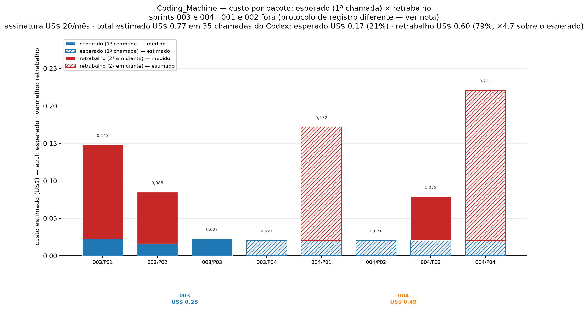

# Chamadas de API do Codex no Coding_Machine

**Pergunta:** quantas chamadas de API o motor autônomo gastou por pacote do backlog, em
que tentativa cada uma aconteceu e com que modelo.
**Fonte:** `.autodev/state.db`, tabela `attempts` (o próprio motor grava uma linha por
invocação).
**Janela:** 28/09/2026 14:19 a 29/09/2026 00:34 —
**sprints 003 e 004**, as únicas no protocolo de registro de hoje (aviso 2).
**Data do relatório:** 29/09/2026.
**Total no período:** **35 chamadas do Codex**, 7 delas aprovadas
(revisão + integração).

## Avisos

1. **Chamada é custo — com a procedência declarada.** Cada linha conta **uma invocação** do
   agente. O motor passou a **gravar tokens** em 28/09 (P-10, lendo o rodapé do agente):
   das 35 chamadas no escopo, **14 têm token medido** e
   as outras foram **estimadas** pela régua do modelo. Todo valor em US$ diz de qual dos
   dois vem — sólido é medição, hachurado é estimativa.
2. **Por que só as sprints 003 e 004.** As sprints **001 e 002 estão fora deste relatório**, e o motivo é de registro, não de mérito: a **001** é história reconstruída (14 dos 15 pacotes são linhas retroativas, sem chamada de API nenhuma), e a **002** foi levantada depois do fato, com várias aprovações por pacote (até 6 no mesmo pacote) e sem um único token medido. Nas sprints **003 e 004** o protocolo é o de hoje: uma chamada de API por tentativa, revisão registrada e token lido do rodapé do agente. Comparar as quatro juntas mediria a diferença de protocolo, não a de modelo.
3. **A 003 ainda está em execução.** Entrou em 28/09 22:58 e tem 1 pacote integrado de 7 (a
   P01 fechou em 6 chamadas, aprovada no 5º degrau, `astra/low`) com a P02 rodando; os outros
   5 ainda não começaram. Os números dela **mudam a cada rodada** — este documento é uma
   foto do momento, não um fechamento.
4. **A sprint 004 está fechada** (4/4 integradas em 28/09) — os números dela não mudam mais.
5. **"Nª tentativa" não é o degrau da escada de modelos — são dois contadores.** O número
   nas tabelas é a **chamada** (`attempt`, sequência do banco, sempre `max+1`); o modelo vem
   do **contador da task** (`tentativas`), pelo mapa `1ª→luna/low … 5ª+→astra/low`. Quando o
   contador é reiniciado (rearme por dependência integrada, reabertura por defeito de
   contrato) ele **volta ao degrau barato** enquanto a numeração da chamada continua — é por
   isso que existe `luna/low` numa 7ª chamada. O degrau mede "quantas vezes chamou", não
   "quão forte era o modelo".
   Nas falhas de infraestrutura (`CODEX_QUOTA`, `NETWORK_ERROR`, `ENVIRONMENT_ERROR`…), a
   política declara `classes_sem_escalonamento` — mas **essa lista não chega à escolha do
   modelo**: o orquestrador usa o mapa do contador e ignora o tier da decisão. Na prática,
   espera de cota escalona como qualquer falha. É um defeito de fiação, não uma intenção.
6. **A partir da 5ª chamada o mapa satura no topo** (`min(tentativa, 5)` → `astra/low`):
   degraus 5 a 15 repetem o mesmo modelo. No período isso **não** virou desperdício: são
   5 chamadas no topo (14.3%) contra
   10 no degrau mais barato (28.6%) — a
   cauda é curta porque a maioria dos pacotes aprovou antes do 5º degrau (tabela 3).
7. **0 combinação(ões) fora da escada declarada:** nenhuma.
   As combinações `…/medium` de 27/09 saíram junto com as sprints 001/002 (foi o dia em que
   a escada foi padronizada); nas 003 e 004 a escada é seguida à risca.
8. **A numeração por pacote tem buracos.** Rearme por dependência integrada e reabertura
   por defeito de contrato removem/renomeiam tentativas, então 1 pacote(s)
   (P01 (sprint 004)) têm sequência descontínua — marcados com ⚠ na
   tabela 1. Consequência para a leitura: o degrau 1 pode se repetir na história de um
   mesmo pacote, e "15 primeiras tentativas para 15 pacotes" é coincidência, não regra.

## O que os números dizem

- **35 chamadas do Codex** em 8 pacotes com execução registrada. A
  mediana é de 4 chamadas por pacote e a média
  4.4.
- **22.9% das chamadas são de 1ª tentativa** e
  37.1% acontecem até a 2ª. Metade do gasto
  (3ª tentativa em diante)
  está na cauda: são poucos pacotes que consumiram a escada inteira.
- **3 pacote(s) resolveram com uma única chamada:**
  P03 (sprint 003), P04 (sprint 003), P02 (sprint 004).
- **Os campeões de gasto:** P04 (sprint 004, 10 chamadas), P01 (sprint 004, 8 chamadas), P01 (sprint 003, 6 chamadas). Os dois são casos conhecidos: a P02 da sprint 2
  pedia reescrita de contrato de teste (o mesmo arquivo para tasks diferentes) e a P04 da
  sprint 4 gastou a escada consertando o próprio comando de teste — 10 tentativas, das
  quais o defeito era meu, não do agente (decisão D-23).
- **A cauda direita do gráfico 1 é o sintoma mais caro do período:** 5 chamadas em
  degraus 11 a 15, todas em pacotes que só destravaram quando o **defeito de motor** foi
  corrigido (D-19, D-24, D-25) — nenhuma delas é "o modelo errado tentando mais".
- **10 das 35 chamadas (28.6%) foram gastas por defeito do
  nosso teste/plano**, e 1 (2.9%) por infraestrutura (cota/crash).
  Descontadas, sobram **24 chamadas (68.6%)** atribuíveis ao
  trabalho do modelo — o denominador honesto para comparar modelos (seção "Descontando").
- **Onde a escada se paga (tabela 3):** 2 pacote(s) aprovaram até a 3ª
  chamada; 2 na 4ª–5ª; 3 da 6ª em diante.
  O degrau caro (`astra/low`) assinou 2 aprovação(ões) —
  sempre em pacote que carregava, junto, defeito de contrato nosso.

## Gráfico 1 — chamadas por pacote, empilhadas pela tentativa


Cada coluna é um pacote; a altura é quantas vezes o Codex foi chamado nele; a cor diz
**em que altura da escada** a chamada aconteceu (verde = cedo, vermelho = fim da
escada). Total: 35 chamadas.

## Tabela 1 — por pacote

`chamadas` é o custo; `aprov./reprov./s/aval.` são as **avaliações do modelo aprovador**
naquele pacote (aprovado / reprovado / chamadas que nem chegaram a ser avaliadas);
`aprovada na` diz **em que chamada** (e com que modelo) a aprovação saiu; `infra` e
`culpa teste/plano` separam o que **não era do modelo** (cota/crash e defeito de
teste/plano, atribuição curada descrita abaixo); `do modelo` é o que sobra.

`retrab. bruto` = **reprovações do aprovador ÷ aprovações do aprovador**, em **múltiplo**:
`2x` significa duas reprovações para cada aprovação entregue (não é porcentagem de nada —
pode passar de 1x, e é por isso que vai em `x` e não em `%`); `retrab. ajust.` desconta as
reprovações que foram culpa do **nosso teste/plano** — nunca as do codificador. Pacote sem
aprovação nenhuma fica `—`. No total: **15 reprovações ÷ 7 aprovações** = **2,1x bruto** e **2,1x ajustado** (a escada cobrou 0 reprovações que eram defeito do NOSSO teste/plano). Se o denominador for *chamadas avaliadas* em vez de aprovações — `reprov ÷ (aprov+reprov)`, aí sim uma fatia — os mesmos números ficam 68.2% e 68.2%.

| sprint | pacote | chamadas | aprov./reprov./s/aval. | chamadas (1ª–última) | aprovada na | infra | culpa teste/plano | do modelo | retrab. bruto | retrab. ajust. | modelos usados |
|---|---:|---:|---|---|---:|---:|---:|---:|---:|---:|---|
| 003 | P01 | 6 | 1/5/0 | 1ª–6ª | 6ª (gpt-6-astra/low) | 0 | 0 | 6 | 5x | 5x | gpt-5.6-luna/low, gpt-5.6-sol/low, gpt-5.6-sol/medium, gpt-5.6-terra/low, gpt-6-astra/low |
| 003 | P02 | 4 | 1/3/0 | 1ª–4ª | 4ª (gpt-5.6-sol/medium) | 0 | 0 | 4 | 3x | 3x | gpt-5.6-luna/low, gpt-5.6-sol/low, gpt-5.6-sol/medium, gpt-5.6-terra/low |
| 003 | P03 | 1 | 1/0/0 | 1ª–1ª | 1ª (gpt-5.6-luna/low) | 0 | 0 | 1 | 0x | 0x | gpt-5.6-luna/low |
| 003 | P04 | 1 | 0/0/1 | 1ª–1ª | — | 0 | 0 | 1 | — | — | gpt-5.6-luna/low |
| 004 | P01 | 8 | 1/2/5 | 1ª–9ª ⚠ | 8ª (gpt-5.6-sol/low) | 0 | 5 | 3 | 2x | 2x | gpt-5.6-luna/low, gpt-5.6-sol/low, gpt-5.6-sol/medium, gpt-5.6-terra/low, gpt-6-astra/low |
| 004 | P02 | 1 | 1/0/0 | 1ª–1ª | 1ª (gpt-5.6-luna/low) | 0 | 0 | 1 | 0x | 0x | gpt-5.6-luna/low |
| 004 | P03 | 4 | 1/2/1 | 1ª–4ª | 4ª (gpt-5.6-sol/medium) | 1 | 0 | 3 | 2x | 2x | gpt-5.6-luna/low, gpt-5.6-sol/low, gpt-5.6-sol/medium, gpt-5.6-terra/low |
| 004 | P04 | 10 | 1/3/6 | 1ª–10ª | 10ª (gpt-6-astra/low) | 0 | 5 | 5 | 3x | 3x | gpt-5.6-luna/low, gpt-5.6-sol/low, gpt-5.6-sol/medium, gpt-5.6-terra/low, gpt-6-astra/low |

## Tabela 3 — em que chamada a aprovação veio

O valor marginal da escada: onde os pacotes **efetivamente** destravaram. É esta tabela
que decide se a 4ª/5ª posição da escada se paga.

| aprovada na | pacotes | quais | modelo que aprovou |
|---|---:|---|---|
| 1ª chamada | 2 | P03 (003), P02 (004) | gpt-5.6-luna/low |
| 2ª–3ª | 0 | — | — |
| 4ª–5ª | 2 | P02 (003), P03 (004) | gpt-5.6-sol/medium |
| 6ª–10ª | 3 | P01 (003), P01 (004), P04 (004) | gpt-5.6-sol/low, gpt-6-astra/low |
| 11ª–15ª | 0 | — | — |

## Descontando o que não era do modelo

A classe da falha o motor grava; **de quem era a culpa, não**. As janelas abaixo foram
atribuídas à mão, olhando os logs e as decisões — e por isso aparecem em coluna separada,
nunca no lugar do dado bruto. Sem esse desconto, qualquer comparação entre modelos cobra
do agente o defeito do nosso teste.

| sprint | pacote | chamadas | culpa teste/plano | do modelo | decisão que descreve |
|---|---:|---:|---:|---:|---|
| 004 | P01 | 8 | 5 | 3 | D-23: critério mandava .venv dentro do worktree (chamadas 1–6) |
| 004 | P04 | 10 | 5 | 5 | D-23: idem (chamadas 1–5) |

No total: **10 chamadas (28.6%)** foram gastas por defeito do
nosso teste/plano e **1 (2.9%) por infraestrutura** (cota, crash).
Sobram **24 chamadas (68.6%)** atribuíveis ao trabalho do modelo —
esse é o único denominador honesto para comparar modelos.


## Gráfico 2 — distribuição por número de tentativa


## Tabela 2 — por degrau

| tentativa | chamadas | % das chamadas | % acumulado | aprovadas | modelos usados |
|---|---:|---:|---:|---:|---|
| 1ª | 8 | 22.9% | 22.9% | 2 | gpt-5.6-luna/low (8) |
| 2ª | 5 | 14.3% | 37.1% | 0 | gpt-5.6-terra/low (5) |
| 3ª | 5 | 14.3% | 51.4% | 0 | gpt-5.6-sol/low (5) |
| 4ª | 4 | 11.4% | 62.9% | 2 | gpt-5.6-sol/medium (4) |
| 5ª | 3 | 8.6% | 71.4% | 0 | gpt-6-astra/low (2), gpt-5.6-sol/medium (1) |
| 6ª | 3 | 8.6% | 80.0% | 1 | gpt-6-astra/low (2), gpt-5.6-luna/low (1) |
| 7ª | 2 | 5.7% | 85.7% | 0 | gpt-5.6-luna/low (1), gpt-5.6-terra/low (1) |
| 8ª | 2 | 5.7% | 91.4% | 0 | gpt-5.6-terra/low (1), gpt-5.6-sol/low (1) |
| 9ª | 2 | 5.7% | 97.1% | 1 | gpt-5.6-sol/low (1), gpt-5.6-sol/medium (1) |
| 10ª | 1 | 2.9% | 100.0% | 1 | gpt-6-astra/low (1) |

## A escada declarada × o que aconteceu

Escada de implementação no `models.yaml` (tentativa → modelo): 1ª `luna/low` · 2ª
`terra/low` · 3ª `sol/low` · 4ª `sol/medium` · 5ª `astra/low`.

O que a base mostra é diferente em pontos importantes, e por motivos conhecidos:

1. **Contador da task ≠ número da chamada** (aviso 5) — a explicação principal. O contador
   reinicia no rearme/reabertura e volta ao degrau barato enquanto a chamada continua sendo
   numerada. Isso é **desejado**: nos rearames de 28/09 a P01 e a P04 voltaram ao degrau 1 e
   subiram de novo — gastaram barato até acertar, em vez de continuar no topo.
2. **Falha de infraestrutura hoje ESCALONA** (aviso 5): a lista
   `classes_sem_escalonamento` existe na política, mas o orquestrador escolhe o modelo pelo
   contador e ignora o tier da decisão. A intenção declarada ("espera de cota não gasta
   degrau") **não está fiada no código** — defeito registrado como pendência.
3. **Saturação depois da 5ª** (aviso 6): o mapa tem 5 entradas, então degraus ≥5 usam
   `astra/low`. No período o topo aparece em 5 das 35 chamadas.
4. **Buracos na numeração** (aviso 8) e **5 chamadas anteriores à padronização** da própria
   escada (aviso 7).

**A pergunta de política que fica:** escalonar por **número** (é o que existe) ou por
**causa** — só escalar quando o teste do código falhar ou o revisor reprovar, e reiniciar no
degrau barato quando a falha foi de infraestrutura/harness. A tabela 3 dá a medida de que
lado pesa: os pacotes que aprovaram até a 3ª chamada mostram quanto trabalho se resolve sem
sair do degrau mais barato.

## Gráfico 3 — custo por pacote: esperado × retrabalho



**Duas leituras na mesma barra.** A **cor** diz se o dinheiro era **esperado** (a 1ª chamada
do pacote, a tentativa de acertar de primeira) ou **retrabalho** (da 2ª em diante: cada
chamada extra existe porque a anterior não passou). O **padrão** diz se aquele pedaço foi
**medido** pelo motor (sólido) ou **estimado** pela régua do modelo (hachurado).

**Esperado × retrabalho.** Do total de US$ 0,77, **US$ 0,17
(21%) era esperado** e **US$ 0,60 (79%) é retrabalho** — o mesmo
backlog custaria **×4,7 menos** se todo pacote passasse de primeira. O
múltiplo aqui é em **dinheiro**; o da Tabela 1 é em **contagem de reprovações**, e os dois
não têm de coincidir (pacote que reprova muito com modelo barato pesa pouco em dólar, e
vice-versa).

Pacotes que mais gastaram insistindo:

| pacote | sprint | chamadas | esperado (US$) | retrabalho (US$) | múltiplo |
|---|---|---|---|---|---|
| P04 | 004 | 10 | 0,021 | 0,200 | 10,7x |
| P01 | 004 | 8 | 0,021 | 0,151 | 8,3x |
| P01 | 003 | 6 | 0,023 | 0,125 | 6,5x |
| P02 | 003 | 4 | 0,016 | 0,069 | 5,3x |
| P03 | 004 | 4 | 0,021 | 0,058 | 3,8x |

Em chamadas: **8** foram a tentativa de acertar de primeira e **27** foram retrabalho.

**O que é medido e o que é estimado.** O motor só começou a gravar tokens em 28/09 (P-10,
lendo o rodapé do Codex): **14 das 35 chamadas (40.0%)** têm token medido. A parte **sólida** da barra é
essa medição; a **hachurada** são as chamadas sem medição, estimadas pela régua de tokens
por chamada do modelo — a média **medida no próprio motor** para aquele modelo/esforço
(5 modelo(s)) e, só para o que o motor nunca viu, a prévia do A/B de
28/09 (4 modelo(s)). Chamada sem régua nenhuma usa a **mediana** das
medidas (53,910 tokens). Nada aqui vem de tabela de preço de terceiro.

**O preço é o da sua assinatura:** US$ 20/mês = 4 blocos semanais de 100% → **US$ 0,05 por
ponto da janela semanal**; a régua medida é 118.096 tokens por ponto → **US$ 0,423 por
milhão de tokens**. Pela janela de 5h a leitura daria US$ 0,37/Mtok (as duas estão no
relatório de eficiência; a semanal é a que limita).

**Total estimado: US$ 0,77** para as 35 chamadas do Codex — sendo
**US$ 0,31 de token medido** e o resto estimativa. Os pacotes mais caros:
**P04** (sprint 004) US$ 0,221; **P01** (sprint 004) US$ 0,172; **P01** (sprint 003) US$ 0,148.

## Objetivos dos pacotes (todas as sprints planejadas até agora)

Uma linha por pacote, com o objetivo como está no `dag.json` de cada sprint — lido do
**plano**, não escrito à mão. É o mapa do que cada pacote do backlog pedia, para ler as
tabelas acima sabendo o que estava sendo pedido em cada um.

::: {.tabela-objetivos}
| sprint | pacote | objetivo (título do pacote no plano) |
|---|---|---|
| 001 | T01 | Detectar agentes de codigo instalados |
| 001 | T02 | Definir schemas de Sprint e de task |
| 001 | T03 | Implementar store de estado em SQLite |
| 001 | T04 | Implementar gerente de worktrees Git |
| 001 | T05 | Implementar adaptador do Codex |
| 001 | T06 | Implementar adaptador do Antigravity/AGY |
| 001 | T07 | Implementar isolamento de execucao (sandbox) |
| 001 | T08 | Implementar runner de testes deterministico |
| 001 | T09 | Implementar revisor independente entre agentes |
| 001 | T10 | Implementar logica de retry e recuperacao |
| 001 | T11 | Implementar Fila de Acao Humana (HAQ) |
| 001 | T12 | Implementar branch de integracao do Sprint |
| 001 | T13 | Implementar geracao do relatorio do Sprint |
| 001 | T14 | Criar projeto-fixture ponta a ponta |
| 001 | T15 | Executar teste de aceitacao autonomo |
| 002 | P01 | Criar autodev/planner.py com os tipos do plano e validacao de schema |
| 002 | P02 | Criar autodev/plan_prompt.py com o prompt de planejamento |
| 002 | P03 | Parsear a resposta do agente de forma tolerante |
| 002 | P04 | Validar o plano contra o DAG real e contra criterio vago |
| 002 | P05 | Escrever o sprint planejado em disco |
| 002 | P06 | Invocar o agente em modo planejamento |
| 002 | P07 | Adicionar o comando autodev plan na CLI |
| 002 | P08 | Provar a aceitacao: do prompt ao sprint executavel |
| 002 | P09 | Registrar a rastreabilidade do prompt ao plano |
| 002 | P10 | Documentar o planejador e fechar a documentacao |
| 003 | P01 | Detectar colisao de arquivo entre tasks do plano |
| 003 | P02 | Barrar colisao na mesma onda no validador do motor |
| 003 | P03 | Relatorio de impacto do plano em modulo proprio |
| 003 | P04 | Comando autodev prever: impacto do plano antes de rodar |
| 003 | P05 | Portao de aprovacao humana do plano |
| 003 | P06 | Aceitacao ponta a ponta do portao do plano |
| 003 | P07 | Documentar o portao do plano e o checklist derivado do D-16 |
| 004 | P01 | Restaurar a hierarquia de secoes do README |
| 004 | P02 | Fazer o teste de documentacao isolar a secao do Planejador |
| 004 | P03 | Tirar do README o que nao bate com o codigo |
| 004 | P04 | Comando de teste nos criterios tem de rodar nesta maquina |
:::

## Arquivos gerados e proveniência

| arquivo | o que é |
|---|---|
| `REPORT-TENTATIVAS-CODEX.md` | este relatório |
| `report/histograma-tentativas.png` | gráfico 1 |
| `report/distribuicao-tentativas.png` | gráfico 2 |
| `report/custo-por-pacote.png` | gráfico 3 (custo estimado: medido × estimado) |
| `report/dados.json` | agregação crua usada no texto e nos gráficos |
| `report/gerar_relatorio_tentativas.py` | gera os três a partir de `.autodev/state.db` |
| `report/relatorio-tentativas.html` / `.pdf` | HTML autocontido e PDF A4 |

Reproduzir:

```bash
cd ~/Code/Coding_Machine
~/.hermes/cache/scratch/venv_report/bin/python report/gerar_relatorio_tentativas.py
pandoc REPORT-TENTATIVAS-CODEX.md -o report/relatorio-tentativas.html --standalone \
  --embed-resources --resource-path=.:report --css=report/estilo-relatorio.css \
  --metadata lang=pt-BR
chromium --headless=new --disable-gpu --no-sandbox --user-data-dir=/tmp/chrome-pdf \
  --virtual-time-budget=30000 --no-pdf-header-footer \
  --print-to-pdf="$PWD/report/relatorio-tentativas.pdf" \
  "file://$PWD/report/relatorio-tentativas.html"
```

O venv `~/.hermes/cache/scratch/venv_report` existe só para o `matplotlib` (o venv do
projeto não tem gráficos) e é descartável: `uv venv` + `uv pip install matplotlib`.
