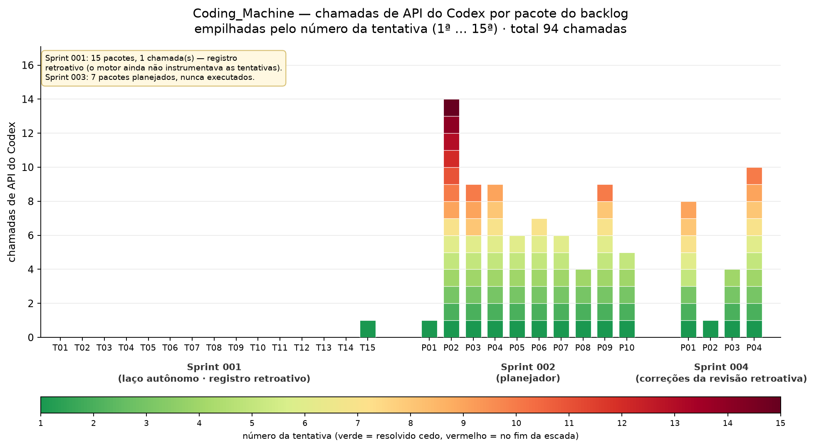
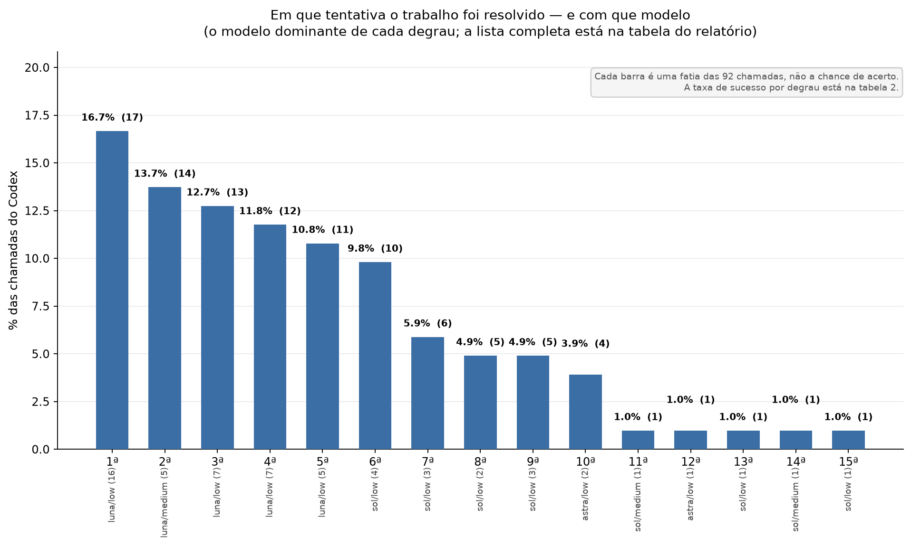

# Chamadas de API do Codex no Coding_Machine

**Pergunta:** quantas chamadas de API o motor autônomo gastou por pacote do backlog, em
que tentativa cada uma aconteceu e com que modelo.
**Fonte:** `.autodev/state.db`, tabela `attempts` (o próprio motor grava uma linha por
invocação).
**Janela:** 27/09/2026 02:03 a 28/09/2026 18:37 —
DEVFACTORY-001, 002 e 004 (a 003 foi planejada e nunca executada).
**Data do relatório:** 28/09/2026.
**Total no período:** **92 chamadas do Codex**, 47 delas aprovadas
(revisão + integração).

## Avisos

1. **Chamada não é custo.** Cada linha conta **uma invocação** do agente; o motor não
   registra tokens, então este relatório mede chamadas, não gasto.
2. **A sprint 001 não é comparável.** Dos seus 15 pacotes, 14 são **registro
   retroativo** (agente `retroativo`, inserido em 27/09 02:03 para reconstruir o
   histórico) — **não são chamadas de API**. Só o T15 tem uma chamada real, e sem
   modelo registrado. É por isso que 14 colunas da sprint 001 estão vazias.
3. **A sprint 003 não aparece no gráfico:** 7 pacotes planejados, nenhum executado.
4. **A sprint 004 está em andamento** (4 de 4
   pacotes já com chamadas; a P03 está aguardando cota do Codex) — os números dela
   ainda vão mudar.
5. **"Nª tentativa" não é o degrau da escada de modelos — são dois contadores.** O número
   nas tabelas é a **chamada** (`attempt`, sequência do banco, sempre `max+1`); o modelo vem
   do **contador da task** (`tentativas`), pelo mapa `1ª→luna/low … 5ª+→astra/low`. Quando o
   contador é reiniciado (rearme por dependência integrada, reabertura por defeito de
   contrato) ele **volta ao degrau barato** enquanto a numeração da chamada continua — é por
   isso que existe `luna/low` numa 7ª chamada. O degrau mede "quantas vezes chamou", não
   "quão forte era o modelo".
   Nas falhas de infraestrutura (`CODEX_QUOTA`, `NETWORK_ERROR`, `ENVIRONMENT_ERROR`…), a
   política declara `classes_sem_escalonamento` — mas **essa lista não chega à escolha do
   modelo**: o orquestrador usa o mapa do contador e ignora o tier da decisão. Na prática,
   espera de cota escalona como qualquer falha. É um defeito de fiação, não uma intenção.
6. **A partir da 5ª chamada o mapa satura no topo** (`min(tentativa, 5)` → `astra/low`):
   degraus 5 a 15 repetem o mesmo modelo. No período isso **não** virou desperdício: são
   8 chamadas no topo (8.7%) contra
   45 no degrau mais barato (48.9%) — a
   cauda é curta porque a maioria dos pacotes aprovou antes do 5º degrau (tabela 3).
7. **3 combinação(ões) fora da escada declarada:** `(nenhum)/(nenhum)`, `gpt-5.6-luna/medium`, `gpt-5.6-terra/medium`.
   As chamadas `luna/medium` e `terra/medium` aconteceram em 27/09 entre 03:13 e 04:07,
   **antes** de a escada ser padronizada naquele mesmo dia — não são desvio de política.
8. **A numeração por pacote tem buracos.** Rearme por dependência integrada e reabertura
   por defeito de contrato removem/renomeiam tentativas, então 4 pacote(s)
   (P02 (sprint 002), P03 (sprint 002), P09 (sprint 002), P01 (sprint 004)) têm sequência descontínua — marcados com ⚠ na
   tabela 1. Consequência para a leitura: o degrau 1 pode se repetir na história de um
   mesmo pacote, e "15 primeiras tentativas para 15 pacotes" é coincidência, não regra.

## O que os números dizem

- **92 chamadas do Codex** em 15 pacotes com execução registrada. A
  mediana é de 6 chamadas por pacote e a média
  6.1.
- **16.3% das chamadas são de 1ª tentativa** e
  29.3% acontecem até a 2ª. Metade do gasto
  (4ª tentativa em diante)
  está na cauda: são poucos pacotes que consumiram a escada inteira.
- **3 pacote(s) resolveram com uma única chamada:**
  T15 (sprint 001), P01 (sprint 002), P02 (sprint 004).
- **Os campeões de gasto:** P02 (sprint 002, 14 chamadas), P04 (sprint 004, 10 chamadas), P03 (sprint 002, 9 chamadas). Os dois são casos conhecidos: a P02 da sprint 2
  pedia reescrita de contrato de teste (o mesmo arquivo para tasks diferentes) e a P04 da
  sprint 4 gastou a escada consertando o próprio comando de teste — 10 tentativas, das
  quais o defeito era meu, não do agente (decisão D-23).
- **A cauda direita do gráfico 1 é o sintoma mais caro do período:** 5 chamadas em
  degraus 11 a 15, todas em pacotes que só destravaram quando o **defeito de motor** foi
  corrigido (D-19, D-24, D-25) — nenhuma delas é "o modelo errado tentando mais".
- **27 das 92 chamadas (29.3%) foram gastas por defeito do
  nosso teste/plano**, e 8 (8.7%) por infraestrutura (cota/crash).
  Descontadas, sobram **57 chamadas (62.0%)** atribuíveis ao
  trabalho do modelo — o denominador honesto para comparar modelos (seção "Descontando").
- **Onde a escada se paga (tabela 3):** 2 pacote(s) aprovaram até a 3ª
  chamada; 2 na 4ª–5ª; 9 da 6ª em diante.
  O degrau caro (`astra/low`) assinou 4 aprovação(ões) —
  sempre em pacote que carregava, junto, defeito de contrato nosso.

## Gráfico 1 — chamadas por pacote, empilhadas pela tentativa



Cada coluna é um pacote; a altura é quantas vezes o Codex foi chamado nele; a cor diz
**em que altura da escada** a chamada aconteceu (verde = cedo, vermelho = fim da
escada). Total: 92 chamadas.

## Tabela 1 — por pacote

`chamadas` é o custo; `aprov./reprov./s/aval.` são as **avaliações do modelo aprovador**
naquele pacote (aprovado / reprovado / chamadas que nem chegaram a ser avaliadas);
`aprovada na` diz **em que chamada** (e com que modelo) a aprovação saiu; `infra` e
`culpa teste/plano` separam o que **não era do modelo** (cota/crash e defeito de
teste/plano, atribuição curada descrita abaixo); `do modelo` é o que sobra.

| sprint | pacote | chamadas | aprov./reprov./s/aval. | chamadas (1ª–última) | aprovada na | infra | culpa teste/plano | do modelo | modelos usados |
|---|---:|---:|---|---|---:|---:|---:|---:|---|
| 001 | T15 | 1 | 0/0/1 | 1ª–1ª | — | 0 | 0 | 1 | (nenhum)/(nenhum) |
| 002 | P01 | 1 | 1/0/0 | 1ª–1ª | 1ª (gpt-5.6-luna/low) | 0 | 0 | 1 | gpt-5.6-luna/low |
| 002 | P02 | 14 | 5/5/4 | 1ª–15ª ⚠ | 14ª (gpt-5.6-sol/low) | 3 | 5 | 6 | gpt-5.6-luna/low, gpt-5.6-luna/medium, gpt-5.6-sol/low, gpt-5.6-sol/medium, gpt-6-astra/low |
| 002 | P03 | 9 | 6/2/1 | 1ª–10ª ⚠ | 9ª (gpt-5.6-sol/medium) | 1 | 5 | 3 | gpt-5.6-luna/low, gpt-5.6-sol/low, gpt-5.6-sol/medium |
| 002 | P04 | 9 | 6/2/1 | 1ª–9ª | 9ª (gpt-6-astra/low) | 1 | 0 | 8 | gpt-5.6-luna/low, gpt-5.6-luna/medium, gpt-5.6-sol/low, gpt-5.6-sol/medium, gpt-6-astra/low |
| 002 | P05 | 6 | 4/2/0 | 1ª–6ª | 6ª (gpt-5.6-sol/low) | 0 | 0 | 6 | gpt-5.6-luna/low, gpt-5.6-luna/medium, gpt-5.6-sol/low, gpt-5.6-terra/medium |
| 002 | P06 | 7 | 5/1/1 | 1ª–7ª | 7ª (gpt-6-astra/low) | 1 | 0 | 6 | gpt-5.6-luna/low, gpt-5.6-sol/low, gpt-5.6-sol/medium, gpt-6-astra/low |
| 002 | P07 | 6 | 4/1/1 | 1ª–6ª | 6ª (gpt-5.6-sol/low) | 0 | 0 | 6 | gpt-5.6-luna/low, gpt-5.6-luna/medium, gpt-5.6-sol/low, gpt-5.6-terra/medium |
| 002 | P08 | 4 | 4/0/0 | 1ª–4ª | 4ª (gpt-5.6-sol/low) | 0 | 0 | 4 | gpt-5.6-luna/low, gpt-5.6-sol/low |
| 002 | P09 | 9 | 4/3/2 | 1ª–10ª ⚠ | 9ª (gpt-6-astra/low) | 1 | 7 | 1 | gpt-5.6-luna/low, gpt-5.6-sol/low, gpt-5.6-sol/medium, gpt-6-astra/low |
| 002 | P10 | 5 | 4/1/0 | 1ª–5ª | 5ª (gpt-5.6-sol/low) | 0 | 0 | 5 | gpt-5.6-luna/low, gpt-5.6-luna/medium, gpt-5.6-sol/low |
| 004 | P01 | 8 | 1/2/5 | 1ª–9ª ⚠ | 8ª (gpt-5.6-sol/low) | 0 | 5 | 3 | gpt-5.6-luna/low, gpt-5.6-sol/low, gpt-5.6-sol/medium, gpt-5.6-terra/low, gpt-6-astra/low |
| 004 | P02 | 1 | 1/0/0 | 1ª–1ª | 1ª (gpt-5.6-luna/low) | 0 | 0 | 1 | gpt-5.6-luna/low |
| 004 | P03 | 2 | 0/1/1 | 1ª–2ª | — | 1 | 0 | 1 | gpt-5.6-luna/low, gpt-5.6-terra/low |
| 004 | P04 | 10 | 1/3/6 | 1ª–10ª | 10ª (gpt-6-astra/low) | 0 | 5 | 5 | gpt-5.6-luna/low, gpt-5.6-sol/low, gpt-5.6-sol/medium, gpt-5.6-terra/low, gpt-6-astra/low |

## Tabela 3 — em que chamada a aprovação veio

O valor marginal da escada: onde os pacotes **efetivamente** destravaram. É esta tabela
que decide se a 4ª/5ª posição da escada se paga.

| aprovada na | pacotes | quais | modelo que aprovou |
|---|---:|---|---|
| 1ª chamada | 2 | P01 (002), P02 (004) | gpt-5.6-luna/low |
| 2ª–3ª | 0 | — | — |
| 4ª–5ª | 2 | P08 (002), P10 (002) | gpt-5.6-sol/low |
| 6ª–10ª | 8 | P03 (002), P04 (002), P05 (002), P06 (002), P07 (002), P09 (002), P01 (004), P04 (004) | gpt-5.6-sol/low, gpt-5.6-sol/medium, gpt-6-astra/low |
| 11ª–15ª | 1 | P02 (002) | gpt-5.6-sol/low |

## Descontando o que não era do modelo

A classe da falha o motor grava; **de quem era a culpa, não**. As janelas abaixo foram
atribuídas à mão, olhando os logs e as decisões — e por isso aparecem em coluna separada,
nunca no lugar do dado bruto. Sem esse desconto, qualquer comparação entre modelos cobra
do agente o defeito do nosso teste.

| sprint | pacote | chamadas | culpa teste/plano | do modelo | decisão que descreve |
|---|---:|---:|---:|---:|---|
| 002 | P09 | 9 | 7 | 1 | D-16: idem (aprovado e refeito no laço de integração) (chamadas 1–3); D-19: contrato de preservação impossível (chamadas 4–8) |
| 002 | P02 | 14 | 5 | 6 | D-16: duas tasks donas do mesmo arquivo de teste (chamadas 1–5) |
| 002 | P03 | 9 | 5 | 3 | D-16: idem (chamadas 1–5) |
| 004 | P01 | 8 | 5 | 3 | D-23: critério mandava .venv dentro do worktree (chamadas 1–6) |
| 004 | P04 | 10 | 5 | 5 | D-23: idem (chamadas 1–5) |

No total: **27 chamadas (29.3%)** foram gastas por defeito do
nosso teste/plano e **8 (8.7%) por infraestrutura** (cota, crash).
Sobram **57 chamadas (62.0%)** atribuíveis ao trabalho do modelo —
esse é o único denominador honesto para comparar modelos.


## Gráfico 2 — distribuição por número de tentativa



## Tabela 2 — por degrau

| tentativa | chamadas | % das chamadas | % acumulado | aprovadas | modelos usados |
|---|---:|---:|---:|---:|---|
| 1ª | 15 | 16.3% | 16.3% | 7 | gpt-5.6-luna/low (14), (nenhum)/(nenhum) (1) |
| 2ª | 12 | 13.0% | 29.3% | 7 | gpt-5.6-luna/medium (5), gpt-5.6-luna/low (4), gpt-5.6-terra/low (3) |
| 3ª | 11 | 12.0% | 41.3% | 9 | gpt-5.6-luna/low (7), gpt-5.6-terra/medium (2), gpt-5.6-sol/low (2) |
| 4ª | 10 | 10.9% | 52.2% | 8 | gpt-5.6-luna/low (7), gpt-5.6-sol/low (2), gpt-5.6-sol/medium (1) |
| 5ª | 10 | 10.9% | 63.0% | 6 | gpt-5.6-luna/low (5), gpt-5.6-sol/low (2), gpt-5.6-sol/medium (2), gpt-6-astra/low (1) |
| 6ª | 9 | 9.8% | 72.8% | 2 | gpt-5.6-sol/low (4), gpt-5.6-luna/low (2), gpt-6-astra/low (2), gpt-5.6-sol/medium (1) |
| 7ª | 6 | 6.5% | 79.3% | 1 | gpt-5.6-sol/low (3), gpt-6-astra/low (1), gpt-5.6-luna/low (1), gpt-5.6-terra/low (1) |
| 8ª | 5 | 5.4% | 84.8% | 1 | gpt-5.6-sol/low (2), gpt-5.6-sol/medium (2), gpt-5.6-terra/low (1) |
| 9ª | 5 | 5.4% | 90.2% | 2 | gpt-5.6-sol/low (3), gpt-6-astra/low (1), gpt-5.6-sol/medium (1) |
| 10ª | 4 | 4.3% | 94.6% | 3 | gpt-6-astra/low (2), gpt-5.6-sol/low (1), gpt-5.6-sol/medium (1) |
| 11ª | 1 | 1.1% | 95.7% | 0 | gpt-5.6-sol/medium (1) |
| 12ª | 1 | 1.1% | 96.7% | 0 | gpt-6-astra/low (1) |
| 13ª | 1 | 1.1% | 97.8% | 0 | gpt-5.6-sol/low (1) |
| 14ª | 1 | 1.1% | 98.9% | 0 | gpt-5.6-sol/medium (1) |
| 15ª | 1 | 1.1% | 100.0% | 1 | gpt-5.6-sol/low (1) |

## A escada declarada × o que aconteceu

Escada de implementação no `models.yaml` (tentativa → modelo): 1ª `luna/low` · 2ª
`terra/low` · 3ª `sol/low` · 4ª `sol/medium` · 5ª `astra/low`.

O que a base mostra é diferente em pontos importantes, e por motivos conhecidos:

1. **Contador da task ≠ número da chamada** (aviso 5) — a explicação principal. O contador
   reinicia no rearme/reabertura e volta ao degrau barato enquanto a chamada continua sendo
   numerada. Isso é **desejado**: nos rearames de 28/09 a P01 e a P04 voltaram ao degrau 1 e
   subiram de novo — gastaram barato até acertar, em vez de continuar no topo.
2. **Falha de infraestrutura hoje ESCALONA** (aviso 5): a lista
   `classes_sem_escalonamento` existe na política, mas o orquestrador escolhe o modelo pelo
   contador e ignora o tier da decisão. A intenção declarada ("espera de cota não gasta
   degrau") **não está fiada no código** — defeito registrado como pendência.
3. **Saturação depois da 5ª** (aviso 6): o mapa tem 5 entradas, então degraus ≥5 usam
   `astra/low`. No período o topo aparece em 8 das 92 chamadas.
4. **Buracos na numeração** (aviso 8) e **5 chamadas anteriores à padronização** da própria
   escada (aviso 7).

**A pergunta de política que fica:** escalonar por **número** (é o que existe) ou por
**causa** — só escalar quando o teste do código falhar ou o revisor reprovar, e reiniciar no
degrau barato quando a falha foi de infraestrutura/harness. A tabela 3 dá a medida de que
lado pesa: os pacotes que aprovaram até a 3ª chamada mostram quanto trabalho se resolve sem
sair do degrau mais barato.

## Arquivos gerados e proveniência

| arquivo | o que é |
|---|---|
| `REPORT-TENTATIVAS-CODEX.md` | este relatório |
| `report/histograma-tentativas.png` | gráfico 1 |
| `report/distribuicao-tentativas.png` | gráfico 2 |
| `report/dados.json` | agregação crua usada no texto e nos gráficos |
| `report/gerar_relatorio_tentativas.py` | gera os três a partir de `.autodev/state.db` |
| `report/relatorio-tentativas.html` / `.pdf` | HTML autocontido e PDF A4 |

Reproduzir:

```bash
cd ~/Code/Coding_Machine
~/.hermes/cache/scratch/venv_report/bin/python report/gerar_relatorio_tentativas.py
pandoc REPORT-TENTATIVAS-CODEX.md -o report/relatorio-tentativas.html --standalone \
  --embed-resources --resource-path=.:report --css=report/estilo-relatorio.css \
  --metadata lang=pt-BR
chromium --headless=new --disable-gpu --no-sandbox --user-data-dir=/tmp/chrome-pdf \
  --virtual-time-budget=30000 --no-pdf-header-footer \
  --print-to-pdf="$PWD/report/relatorio-tentativas.pdf" \
  "file://$PWD/report/relatorio-tentativas.html"
```

O venv `~/.hermes/cache/scratch/venv_report` existe só para o `matplotlib` (o venv do
projeto não tem gráficos) e é descartável: `uv venv` + `uv pip install matplotlib`.
